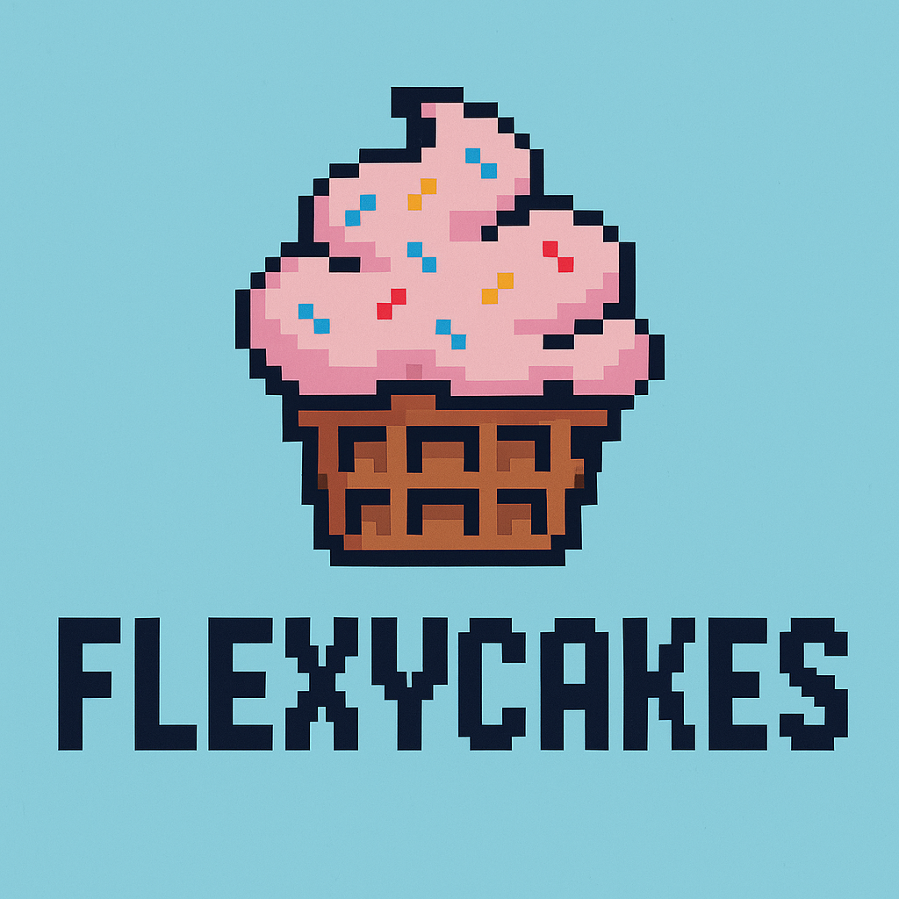

<div align="center">
        <a href="https://github.com/powerdragonfire/flexycakes" title="Flexycakes">
            
        </a>
</div>

<div align="center">

[](https://www.npmjs.com/package/flexycakes)
[](https://github.com/powerdragonfire/flexycakes/blob/master/LICENSE)
[](https://discord.gg/7bERmQjH)

</div>

<p align="center">
  <a href="https://powerdragonfire.github.io/flexycakes/demos/v1.0/demo/index.html">Examples</a> | 
  <a href="https://powerdragonfire.github.io/flexycakes/demos/v1.0/typedoc/index.html">API</a> |
  <a href="#quick-start">Quick Start</a> |
  <a href="https://github.com/users/powerdragonfire/projects/10/views/1">Feature Tracker</a> |
  <a href="https://codesandbox.io/p/devbox/flexlayout-example-master-forked-g3tdzn?workspaceId=ws_Uv3sirbkAsy6tf81TaC9XG">Sandbox</a> |
  <a href="https://github.com/caplin/FlexLayout">Flexlayout</a>
</p>

This is **Flexycakes**, a fork of FlexLayout with enhanced features including pin/unpin functionality for panels. Flexycakes extends the original FlexLayout capabilities with additional user interface improvements and workflow optimizations.

## 📍 Pin Board

<div align="center">

### 💰 Paid Bounties Program

</div>

> **🚀 Exciting News!** We're launching a paid bounty system to support young developers in the open source community.

<div align="center">

[](https://discord.gg/7bERmQjH)

</div>

**What we're working on:**

- 🔍 Researching the best bounty platforms
- 📋 Setting up contract logistics
- 🎯 Defining contribution opportunities
- 💡 Creating developer-friendly workflows

**Stay tuned:** Join our Discord community for real-time updates and early access to bounty opportunities!

## 🚀 Quick Start

### Installation

Install Flexycakes from npm:

```bash
npm install flexycakes
```

or using yarn:

```bash
yarn add flexycakes
```

or using pnpm:

```bash
pnpm add flexycakes
```

### Basic Setup

1. **Import the components:**

    ```javascript
    import { Layout, Model } from "flexycakes";
    ```

2. **Include a theme:**

    **Option A:** Import in your JavaScript code:

    ```javascript
    import "flexycakes/style/light.css";
    ```

    **Option B:** Link in your HTML:

    ```html
    <link rel="stylesheet" href="/style/light.css" />
    ```

3. **Optional:** For dynamic theming, see [Theme Switching](#theme-switching)

### Development Setup with Symbolic Linking

If you're contributing to Flexycakes or want to develop locally:

1. **Clone the repository:**

    ```bash
    git clone https://github.com/powerdragonfire/flexycakes.git
    cd flexycakes
    ```

2. **Install dependencies:**

    ```bash
    pnpm install
    ```

3. **Create a symbolic link:**

    ```bash
    # Build the library first
    pnpm build

    # Create global link
    npm link
    # or with pnpm
    pnpm link --global
    ```

4. **Link in your project:**

    ```bash
    cd /path/to/your/project
    npm link flexycakes
    # or with pnpm
    pnpm link --global flexycakes
    ```

5. **Start development mode:**

    ```bash
    # In flexycakes directory
    pnpm dev
    ```

    This will watch for changes and rebuild automatically.

---

## 📖 Usage Guide

### Basic Layout Setup

The `<Layout>` component renders the tabsets and splitters. Here's what you need:

#### Required Props

| Prop      | Type     | Description                               |
| --------- | -------- | ----------------------------------------- |
| `model`   | Model    | The layout model containing the structure |
| `factory` | Function | Creates React components for each tab     |

> 💡 **Tip:** See [Optional Layout Props](#layout-properties) for additional configuration options.

### Core Concepts

The **model** is a tree of Node objects that define your layout structure:

- Created using `Model.fromJson(jsonObject)`
- Saved using `model.toJson()`

The **factory** function takes a Node object and returns the React component to render in that tab.

### Simple Example

```javascript
// Define your layout structure
const json = {
    global: {},
    borders: [],
    layout: {
        type: "row",
        weight: 100,
        children: [
            {
                type: "tabset",
                weight: 50,
                children: [
                    {
                        type: "tab",
                        name: "Dashboard",
                        component: "dashboard",
                    },
                ],
            },
            {
                type: "tabset",
                weight: 50,
                children: [
                    {
                        type: "tab",
                        name: "Settings",
                        component: "settings",
                    },
                ],
            },
        ],
    },
};

// Create your app
const model = Model.fromJson(json);

function App() {
    const factory = (node) => {
        const component = node.getComponent();

        switch (component) {
            case "dashboard":
                return <DashboardComponent />;
            case "settings":
                return <SettingsComponent />;
            default:
                return <div>{node.getName()}</div>;
        }
    };

    return <Layout model={model} factory={factory} />;
}
```


> 🎮 **Try it live:** [CodeSandbox Demo](https://codesandbox.io/p/devbox/flexlayout-example-master-forked-g3tdzn?workspaceId=ws_Uv3sirbkAsy6tf81TaC9XG) | [TypeScript Example](https://github.com/nealus/flexlayout-vite-example)

---

## 🏗️ Layout Structure

### JSON Model Components

The model JSON has 4 main sections:

| Section   | Required | Description                                    |
| --------- | -------- | ---------------------------------------------- |
| `global`  | ❌       | Global layout options                          |
| `layout`  | ✅       | Main layout hierarchy                          |
| `borders` | ❌       | Edge panels ("top", "bottom", "left", "right") |
| `popouts` | ❌       | External window definitions                    |

### Node Types

#### 🔹 Row Nodes

- **Purpose:** Container for tabsets and child rows
- **Orientation:** Top-level rows are horizontal (unless `rootOrientationVertical` is set)
- **Children:** Tabsets and other rows

#### 🔹 TabSet Nodes

- **Purpose:** Container for tabs
- **Properties:** List of tabs + selected tab index
- **Behavior:** Auto-created when tabs move, deleted when empty (unless `enableDeleteWhenEmpty: false`)

#### 🔹 Tab Nodes

- **Purpose:** Individual panel content
- **Properties:** Component name (for factory) + display text
- **Content:** Loaded via the factory function

#### 🔹 Border Nodes

- **Purpose:** Edge-docked panels
- **Location:** Can only exist in the `borders` section
- **Behavior:** Similar to tabsets but docked to screen edges


> 💡 **Pro Tip:** Use the [demo app](https://rawgit.com/caplin/FlexLayout/demos/demos/v0.8/demo/index.html) to visually create layouts, then export the JSON via 'Show Layout JSON in console'.

### Weight System

Node weights determine relative sizing:

- **Example:** Weights of 30,70 = same as 3,7
- **Usage:** Only relative values matter
- **Application:** Applies to rows and tabsets within their parent

---

## 🎨 Customization

### Theme Switching

#### Available Themes

- `light.css` - Clean light theme
- `dark.css` - Dark mode theme
- `gray.css` - Neutral gray theme
- `underline.css` - Minimal underline style
- `rounded.css` - Rounded corners theme
- `combined.css` - All themes in one file

#### Dynamic Theme Switching

Use the `combined.css` theme for runtime switching:

```javascript
// Setup with theme container
<div ref={containerRef} className="flexlayout__theme_light">
    <Layout model={model} factory={factory} />
</div>;

// Change theme programmatically
containerRef.current.className = "flexlayout__theme_dark";
```

### Custom Tab Rendering

Customize individual tabs with `onRenderTab`:


```javascript
const onRenderTab = (node, renderValues) => {
    // renderValues.leading = <Icon />; (red area)
    // renderValues.content += " *"; (green area)
    renderValues.buttons.push(<MenuIcon key="menu" />); // yellow area
};

<Layout model={model} factory={factory} onRenderTab={onRenderTab} />;
```

### Custom TabSet Rendering

Customize tabset headers with `onRenderTabSet`:


```javascript
const onRenderTabSet = (node, renderValues) => {
    // Add persistent buttons (red area)
    renderValues.stickyButtons.push(
        <button key="add" onClick={() => addNewTab(node)}>
            +
        </button>,
    );

    // Add contextual buttons (green area)
    renderValues.buttons.push(<SettingsIcon key="settings" />);
};
```

---

## ⚡ Actions & Events

### Model Actions

All layout changes happen through actions via `Model.doAction()`:

```javascript
// Add a new tab
model.doAction(
    Actions.addNode(
        { type: "tab", component: "grid", name: "New Grid" },
        "targetTabsetId",
        DockLocation.CENTER,
        0, // position (use -1 for end)
    ),
);

// Update global settings
model.doAction(
    Actions.updateModelAttributes({
        splitterSize: 40,
    }),
);
```

> 📚 **Reference:** [Full Actions API](https://rawgit.com/caplin/FlexLayout/demos/demos/v0.8/typedoc/classes/Actions.html)

### Tab Events

Handle tab lifecycle events:

```javascript
function MyComponent({ node }) {
    useEffect(() => {
        // Listen for resize events
        node.setEventListener("resize", ({ rect }) => {
            console.log("Tab resized:", rect);
        });

        // Save data before serialization
        node.setEventListener("save", () => {
            node.getConfig().myData = getCurrentData();
        });

        // Handle visibility changes
        node.setEventListener("visibility", ({ visible }) => {
            if (visible) startUpdates();
            else stopUpdates();
        });
    }, [node]);
}
```

#### Available Events

| Event        | Parameters  | Description                  |
| ------------ | ----------- | ---------------------------- |
| `resize`     | `{rect}`    | Tab resized during layout    |
| `close`      | `none`      | Tab is being closed          |
| `visibility` | `{visible}` | Tab visibility changed       |
| `save`       | `none`      | Before serialization to JSON |

---

## 🪟 Popout Windows

### Overview

Render tabs in external browser windows for multi-monitor setups.

### Setup Requirements

1. **HTML Host Page:** Copy `popout.html` to your public directory
2. **Tab Configuration:** Add `enablePopout: true` to tab definitions
3. **Styling:** Styles are automatically copied from main window

### Code Considerations

Popout windows use a different `document` and `window`. Access them via:

```javascript
function PopoutComponent() {
    const selfRef = useRef();

    const handleEvent = () => {
        // ❌ Wrong - uses main window
        document.addEventListener("click", handler);

        // ✅ Correct - uses popout window
        const popoutDoc = selfRef.current.ownerDocument;
        const popoutWindow = popoutDoc.defaultView;
        popoutDoc.addEventListener("click", handler);
    };

    return <div ref={selfRef}>Content</div>;
}
```

### Limitations

- ⚠️ **Context:** Code runs in main window JS context
- ⚠️ **Events:** Must use popout window/document for listeners
- ⚠️ **Throttling:** Timers throttle when main window is hidden
- ⚠️ **Libraries:** Third-party controls may not work without modification
- ⚠️ **Zoom:** Incorrect sizing when browser is zoomed
- ⚠️ **State:** Windows can't reload in maximized/minimized states

> 📖 **Deep Dive:** [React Portals in Popups](https://dev.to/noriste/the-challenges-of-rendering-an-openlayers-map-in-a-popup-through-react-2elh)

---

## 🛠️ Development

### Running Locally

```bash
# Install dependencies
pnpm install

# Start development server
pnpm dev

# Run tests (in separate terminal)
pnpm playwright
```


### Building

```bash
# Build for distribution
pnpm build
```

The built files will be in the `dist/` directory.

---

## 📚 Appendix

<details>
<summary><strong>🔧 Configuration Reference</strong></summary>

### Layout Properties

Complete list of optional props for the `<Layout>` component:

- [Layout Properties Documentation](https://rawgit.com/caplin/FlexLayout/demos/demos/v0.8/typedoc/interfaces/ILayoutProps.html)

### JSON Model Schemas

TypeScript interfaces for all configuration objects:

#### Core Model

- [Model Attributes](https://rawgit.com/caplin/FlexLayout/demos/demos/v0.8/typedoc/interfaces/IJsonModel.html)
- [Global Attributes](https://rawgit.com/caplin/FlexLayout/demos/demos/v0.8/typedoc/interfaces/IGlobalAttributes.html)

#### Node Types

- [Row Attributes](https://rawgit.com/caplin/FlexLayout/demos/demos/v0.8/typedoc/interfaces/IJsonRowNode.html)
- [TabSet Attributes](https://rawgit.com/caplin/FlexLayout/demos/demos/v0.8/typedoc/interfaces/IJsonTabSetNode.html)
- [Tab Attributes](https://rawgit.com/caplin/FlexLayout/demos/demos/v0.8/typedoc/interfaces/IJsonTabNode.html)
- [Border Attributes](https://rawgit.com/caplin/FlexLayout/demos/demos/v0.8/typedoc/interfaces/IJsonBorderNode.html)

</details>

<details>
<summary><strong>🎯 Advanced Usage</strong></summary>

### Layout Component Methods

Programmatically add tabs using Layout component methods:

```javascript
// Get reference to Layout component
const layoutRef = useRef();

// Add tab to specific tabset
layoutRef.current.addTabToTabSet("NAVIGATION", {
    type: "tab",
    component: "grid",
    name: "New Grid",
});
```

[Complete Layout Methods API](https://rawgit.com/caplin/FlexLayout/demos/demos/v0.8/typedoc/classes/Layout.html)

### Multi-Splitter Mode

Remove tabs entirely for a pure splitter interface:

```javascript
const json = {
    global: {
        tabSetEnableTabStrip: false,
    },
    // ... rest of layout
};
```

### Node ID Management

```javascript
// Auto-generated IDs are UUIDs
const autoId = "#0c459064-8dee-444e-8636-eb9ab910fb27";

// Get node ID
const nodeId = node.getId();

// Use in actions
model.doAction(Actions.selectTab(nodeId));
```

</details>

<details>
<summary><strong>🔗 Alternative Solutions</strong></summary>

Comparing Flexycakes with other React layout managers:

| Library        | Repository                                                                    | Key Features                       |
| -------------- | ----------------------------------------------------------------------------- | ---------------------------------- |
| **Flexycakes** | [powerdragonfire/flexycakes](https://github.com/powerdragonfire/flexycakes)   | Enhanced FlexLayout with pin/unpin |
| rc-dock        | [ticlo/rc-dock](https://github.com/ticlo/rc-dock)                             | Dock-style layouts                 |
| Dockview       | [dockview.dev](https://dockview.dev/)                                         | Modern docking solution            |
| Lumino         | [jupyterlab/lumino](https://github.com/jupyterlab/lumino)                     | JupyterLab's layout system         |
| Golden Layout  | [golden-layout/golden-layout](https://github.com/golden-layout/golden-layout) | Multi-window layouts               |
| React Mosaic   | [nomcopter/react-mosaic](https://github.com/nomcopter/react-mosaic)           | Tiling window manager              |

</details>

<details>
<summary><strong>📋 Migration Guide</strong></summary>

### From FlexLayout to Flexycakes

Flexycakes is a drop-in replacement for FlexLayout with additional features:

1. **Update package:**

    ```bash
    npm uninstall flexlayout-react
    npm install flexycakes
    ```

2. **Update imports:**

    ```javascript
    // Before
    import FlexLayout from "flexlayout-react";

    // After
    import { Layout, Model } from "flexycakes";
    ```

3. **Update CSS imports:**

    ```javascript
    // Before
    import "flexlayout-react/style/light.css";

    // After
    import "flexycakes/style/light.css";
    ```

### New Features in Flexycakes

- 📌 Pin/Unpin functionality for panels
- 🎨 Enhanced UI components
- ⚡ Improved workflow optimizations
- 🔧 Additional customization options

</details>

---
